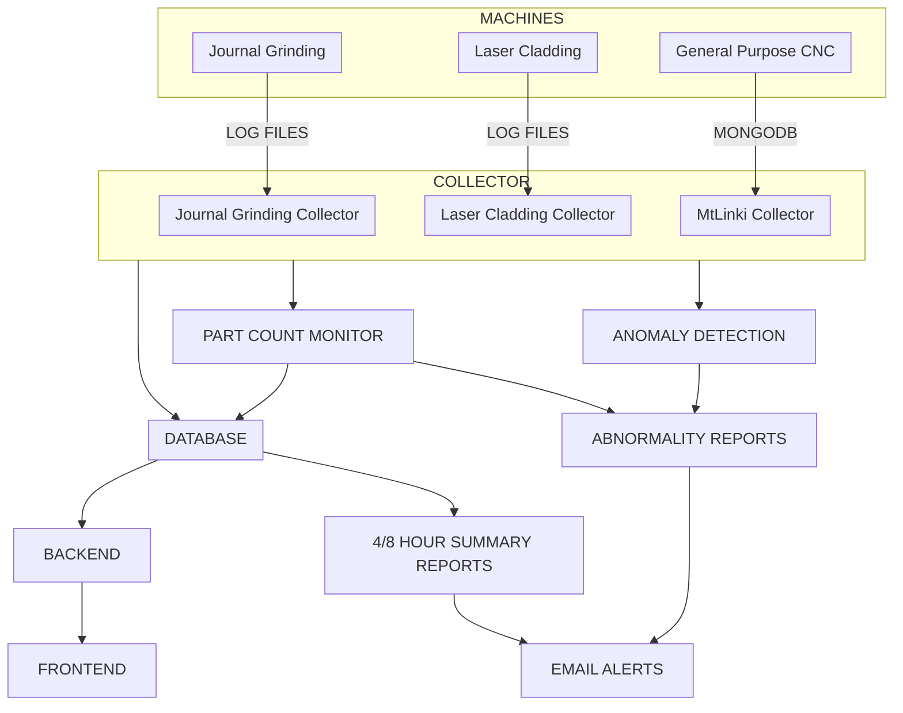
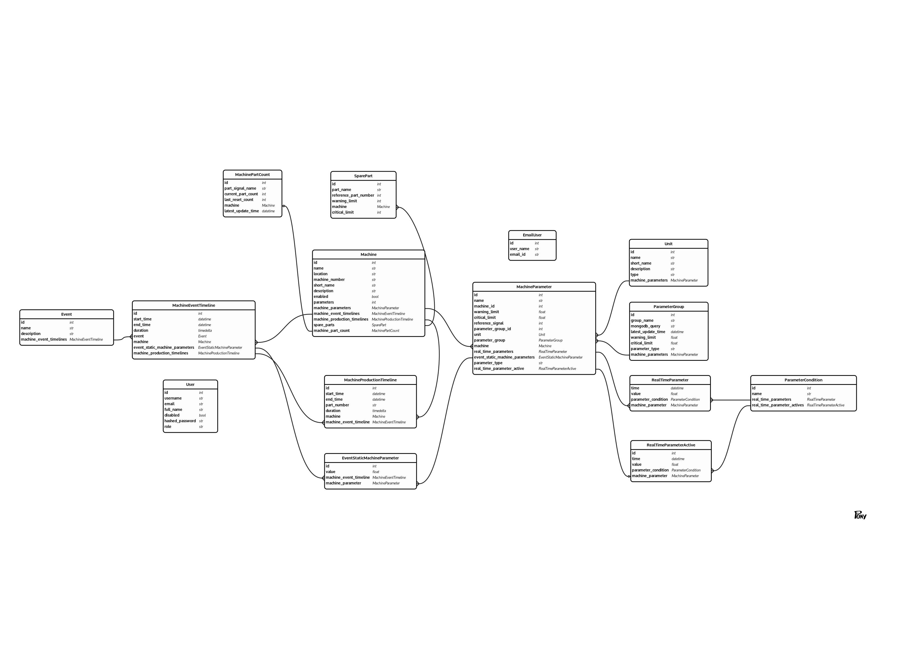
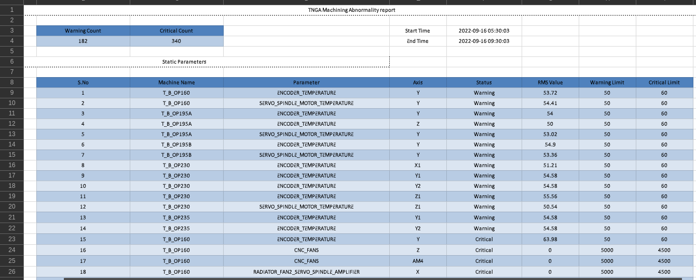

# Technical Stack

## Introduction
Based on the requirements and nature of the current system, the figure below shows the overall architecture of the proposed solution.

## Implementation
All the requried services are developed using python script and deployed as linux daemon services.

### Collectors

- **MtLinki Collector**
    - **Static Collector** - This service collects all new data from the MtLinki mongodb database for the 16 static parameter group.

    - **Dynamic Collector** - This service collects all new data from the MtLinki mongodb database for the 1 dynamic (servo and spindle load) parameter group.

- **Lasser Cladding Collector** - This service collects data from the laser cladding machine from its log files.

- **Journal Grinding Collector** - This service collects all new data from the journal grinding machine from its log files.

### Anomaly Detection

The anomaly detection for cnc machines are implemeted as part of the collector services.

- **Static Parameters** - The anomaly detection for the 16 parameter groups are part of the static collector service and it works by simply {==checking if the current value of the parameters are within the normal working range==}.

- **Dynamic Parameters** - The anomaly detection for the 1 parameter group (Servo and Spindle load) are part of the dynamic collector service and {==it works using Kruskal–Wallis one-way analysis of variance algorithm==}. This method compares the signal values for a new cycle with a reference signal, for any anomaly.

### Part Count Monitor

The machine part counts (for 59 cnc machines) are monitored from the parameter "para name". Once the reset button on the machine controller is pressed, the part count will be reset to zero. But to get a cumulative part count, we store the last part count value before the reset button was pressed, then whenever the part count is increased, the actual part count would be the part count before the press of reset button plus the current part count value. The formula for that is given below:

$$
\operatorname{} P_{A} = P_{Current} + P_{Cumulative}        ....... 1
$$

Where,
P~A~ --> Actual Part Count

P~Current~ --> Current Part Count

P~Cumulative~ --> Cumulative Part Count Before Press of Reset Button

### Abnormality Reports

Different abnormalities are generated as an excel report as soon as they are recorded, and stored in a common location (Where the email alerts service will be looking for new report), these files will be deleted as soon as they are sent as email alerts by the email alerts services. The following things will create an abnormality report:

- **Static Parameter Abnormality** - This will be recorded by the static collector as soon as {==any parameter goes beyond it's normal working range==}. A sample report is shown below.

- **Dynamic Parameter Abnormality** - This will be recorded by the dynamic collector as soon as {==any set of parameters belonging to a specific cycle is not similar to it's reference signal==}. A sample report is shown below.

- **Part Count Alert** - This will be recorded by the part count monitor as soon as {==any component of a machine exceeded it's part count limit and needs to be replaced==}. A sample report is shown below.

### Database

From the requirements and nature of current system, we've choosen timescale db as the database to store all the data. The entity relationship diargrams of all the table of the database is shown below:

{ align=center }

The details of all the tables are given below:

1. **Machine** - This table will consist of data related to all the ***machines*** available at tiei new plant (including spm machines). The details of it's columns are given below:

    - **id**
        - **Description** - The prime identifier for any row within this table.
        - **Type** - Integer

    - **name**
        - **Description** - This is the name of the machine
        - **Type** - String

    - **location**
        - **Description** - The location of the machine within the plant (crank, block, engine line)
        - **Type** - String

    - **machine_number**
        - **Description** - This is the number of the machine.
        - **Type** - String

    - **short_name**
        - **Description** - This is a short name for the machine
        - **Type** - String

    - **description**
        - **Description** - This is a short description of the machine
        - **Type** - String
    - **enabled**
        - **Description** - The columns is used to represent if the machine is enabled or not
        - **Type** - Bool

    - **parameters**
        - **Description** - This gives the total number of parameters this machine has
        - **Type** - Integer

1. **Unit** - This table will consist of data related to all the ***units of parameters*** of machines available at tiei new plant (including spm machines). The details of it's columns are given below:

    - **id**
        - **Description** - The prime identifier for any row within this table.
        - **Type** - Integer

    - **name**
        - **Description** - This is the name of the unit for a machine parameter
        - **Type** - String

    - **short_name**
        - **Description** - This is a short name for the unit
        - **Type** - String

    - **description**
        - **Description** - This is the short description of the unit
        - **Type** - String

    - **type**
        - **Description** - TBA (To Be Addressed)
        - **Type** - String

1. **ParameterGroup** - This table will consist of data related to all the ***groups of parameters*** (especially for the 59 cnc machines), such as apc battery, encoder temperature, etc. The details of it's columns are given below:

    - **id**
        - **Description** - The prime identifier for any row within this table.
        - **Type** - Integer

    - **mongodb_query**
        - **Description** - This is the regex pattern used to wildcard only the parameter names (as available in the Fanuc MtLinki Mongodb) belonging to the parameter group, for example "load" to query all servo and spindle loads (which belongs to dynamic parameter group). This is used internally by the collector services to query parameters from different groups.
        - **Type** - String

    - **latest_update_time**
        - **Description** - This is the latest time for which new data was available for the parameter group as whole. For example ServoLoadOp150 has latest end time as time1 and SpindleLoadOP150 has end time as time2, the latest_update_time (for this parameter group would be) time2.
        - **Type** - float

    - **warning_limit**
        - **Description** - This is the warning limit (only available for static parameters) (this will be used if in case the individual parameter doesn't have limits)
        - **Type** - Integer

    - **critical_limit**
        - **Description** - This is the critical limit (only available for static parameters) (this will be used if in case the individual parameter doesn't have limits)
        - **Type** - Integer

    - **parameter_type**
        - **Description** - This value is used to tell if the parameter (applicable only for static parameters) is of type increasing or decreasing. If increasing means, the critical limit value will be greater than warning limit, such as encoder temperature.
        - **Type** - String

1. **MachineParameter** - This table will consist of data related to all the ***parameters of machines*** available at tiei new plant (including spm machines). The details of it's columns are given below:

    - **id**
        - **Description** - The prime identifier for any row within this table.
        - **Type** - Integer

    - **name**
        - **Description** - This is the name of the machine parameter
        - **Type** - String

    - **machine_id**
        - **Description** - This is a foreign key, and refers to the id of ***Machines*** table, this shows the machine to which this parameter belongs to.
        - **Type** - Integer

    - **warning_limit**
        - **Description** - This is the warning limit (only available for static parameters)
        - **Type** - Integer

    - **critical_limit**
        - **Description** - This is the critical limit (only available for static parameters)
        - **Type** - Integer

    - **reference_signal**
        - **Description** - This is the reference signal that are considers as good signal for this parameter (only available for dynamic parameters).
        - **Type** - Array of Float

    - **parameter_group_id**
        - **Description** - This is a foreign key, refering to the id column of the ***ParameterGroup*** table, to represent the parameter group that this parameter belongs to.
        - **Type** - Integer

    - **unit**
        - **Description** - This is a foreign key, refering to the id column of the ***Unit*** table, to represent the unit parameter has.
        - **Type** - Integer

    - **parameter_type**
        - **Description** - This value is used to tell if the parameter (applicable only for static parameters) is of type increasing or decreasing. If increasing means, the critical limit value will be greater than warning limit, such as encoder temperature.
        - **Type** - String

1. **Event** - This table will consist of data related to all ***events related to a machine***, such as production, breakdown. The details of it's columns are given below:

    - **id**
        - **Description** - The prime identifier for any row within this table.
        - **Type** - Integer

    - **name**
        - **Description** - This is the name of the event.
        - **Type** - String

    - **descrtiption**
        - **Description** - This is a short description of the event.
        - **Type** - String

1. **MachineEventTimeline** - This table will consist of data related to all ***events timeline data*** related to a machine. This table is specifically used to store the event data related to spm machines (especially laser cladding machine). The details of it's columns are given below:

    - **id**
        - **Description** - The prime identifier for any row within this table.
        - **Type** - Integer

    - **start_time**
        - **Description** - This is the start time of the event.
        - **Type** - Datetime

    - **end_time**
        - **Description** - This is the end time of the event.
        - **Type** - Datetime

    - **duration**
        - **Description** - This is the duration of the event.
        - **Type** - Timedelta

    - **event_id**
        - **Description** - This is a foreign key, and refers to the id column of ***Events*** table, this shows event to which this record of timeline data belongs to.
        - **Type** - Integer

    - **machine_id**
        - **Description** - This is a foreign key, and refers to the id of ***Machines*** table, this shows the machine to which this parameter belongs to.
        - **Type** - Integer

1. **MachineProductionTimeline** - This table will consist of data related to all ***production timeline data*** related to a machine. This table is specifically used to store the production data related to spm machines (especially laser cladding machine). The details of it's columns are given below:

    - **id**
        - **Description** - The prime identifier for any row within this table.
        - **Type** - Integer

    - **start_time**
        - **Description** - This is the start time of the production.
        - **Type** - Datetime

    - **end_time**
        - **Description** - This is the end time of the production.
        - **Type** - Datetime

    - **duration**
        - **Description** - This is the duration of the production.
        - **Type** - Timedelta

    - **machine_event_timeline**
        - **Description** - This is a foreign key, and refers to the id column of ***MachineEventTimeline*** table, this shows event timeline to which this record of machine production timeline data belongs to.
        - **Type** - Integer

    - **machine_id**
        - **Description** - This is a foreign key, and refers to the id of ***Machines*** table, this shows the machine to which this parameter belongs to.
        - **Type** - Integer

    - **part_number**
        - **Description** - This is the part number of the component manufactured during this production cycle.
        - **Type** - String

1. **User** - This table will consist of data related to all ***Users*** registered to access the web application. The details of it's columns are given below:

    - **id**
        - **Description** - The prime identifier for any row within this table.
        - **Type** - Integer

    - **username**
        - **Description** - This is the user name.
        - **Type** - String

    - **email**
        - **Description** - This is the email id of the user.
        - **Type** - String

    - **full_name**
        - **Description** - This is the full name of the user.
        - **Type** - String

    - **disabled**
        - **Description** - This is a boolean variable used to check if the user is enabled or not
        - **Type** - Bool

    - **hashed_password**
        - **Description** - This is the (hashed) password of the user.
        - **Type** - String

    - **role**
        - **Description** - This is the role of the user.
        - **Type** - String

1. **EmailUser** - This table will consist of data related to all ***Email Ids*** of users for whom email reports needs to sent. The details of it's columns are given below:

    - **id**
        - **Description** - The prime identifier for any row within this table.
        - **Type** - Integer

    - **username**
        - **Description** - This is the user name.
        - **Type** - String

    - **email_id**
        - **Description** - This is the email id of the user that will receive email alerts.
        - **Type** - String

    - **full_name**
        - **Description** - This is the full name of the user.
        - **Type** - String

    - **disabled**
        - **Description** - This is a boolean variable used to check if the user is enabled or not
        - **Type** - Bool

    - **hashed_password**
        - **Description** - This is the (hashed) password of the user.
        - **Type** - String

    - **role**
        - **Description** - This is the role of the user.
        - **Type** - String
    
    !!! note

        If the user (of this application) wants to add or remove any email id that receives email alerts about abnormality, he/she needs to modify this table directly

1. **SparePart** - This table will consist of data related to all ***Spare Parts*** of all the machines. The details of it's columns are given below:

    - **id**
        - **Description** - The prime identifier for any row within this table.
        - **Type** - Integer

    - **part_name**
        - **Description** - This is the part name.
        - **Type** - String

    - **referenc_part_number**
        - **Description** - This is the cumulative part count of the machine, just before the press of reset button. This is the P~Cumulative~ in equation 1.
        - **Type** - String

    - **warning_limit**
        - **Description** - This is the warning part count limit.
        - **Type** - Integer

    - **critical_limit**
        - **Description** - This is the critical part count limit.
        - **Type** - Integer

    - **machine_id**
        - **Description** - This is a foreign key, and refers to the id of ***Machines*** table, this shows the machine to which this spare part belongs to.
        - **Type** - Integer

1. **MachinePartCount** - This table will consist of ***part count*** data of all the machines. The details of it's columns are given below:

    - **id**
        - **Description** - The prime identifier for any row within this table.
        - **Type** - Integer

    - **part_signal_name**
        - **Description** - This is the signal/parameter name which holds the part count for the machine (as stored in the mongodb).
        - **Type** - String

    - **current_part_count**
        - **Description** - This is the current part count for the machine (as denoted buy the machine column)
        - **Type** - Integer

    - **last_reset_count**
        - **Description** - This is the part count of the machine just before the reset button was pressed. This is used to find the cumulative part count of machine, that is if the maachine part count was 500 just before the resetting it, then after that the cumulative part count would be 500 + 1, 500 + 2, and so on where 500 is your last_reset_count and 1/2 is your current_part_count.
        - **Type** - Integer

    - **machine_id**
        - **Description** - This is a foreign key, and refers to the id of ***Machines*** table, this shows the machine to which this spare part belongs to.
        - **Type** - Integer

    - **latest_update_time**
        - **Description** - This is the recent most timestamp during which the part count was updated (as stored in the mongodb).

1. **ParameterCondition** - This table will consist of data related to all ***conditions*** of a parameter, such as ok, warning and critical. The details of it's columns are given below:

    - **id**
        - **Description** - The prime identifier for any row within this table.
        - **Type** - Integer

    - **name**
        - **Description** - This is the condition name.
        - **Type** - String

1. **EventStaticMachineParameter** - This table will consist of real time static data related to all ***events of a machine***. This is specifically used for SPM machines (especially laser cladding). The details of it's columns are given below:

    - **id**
        - **Description** - The prime identifier for any row within this table.
        - **Type** - Integer

    - **value**
        - **Description** - This is the value of the parameter.
        - **Type** - float

    - **machine_event_timeline_id**
        - **Description** - This is a foreign key, and refers to the id of ***MachineEventTimeline*** table, this shows the event timeline to which this event static machine parameter value belongs to.
        - **Type** - Integer

    - **machine_parameter_id**
        - **Description** - This is a foreign key, and refers to the id of ***MachineParameter*** table, this shows the machine parameter to which this record of value belongs to.
        - **Type** - Integer

1. **RealTimeParameter** - This table will consist of ***real time data related to all machine***. The details of it's columns are given below:

    - **id**
        - **Description** - The prime identifier for any row within this table.
        - **Type** - Integer

    - **value**
        - **Description** - This is the value of the parameter.
        - **Type** - float

    - **parameter_condition_id**
        - **Description** - This is a foreign key, and refers to the id of ***ParameterCondition*** table, this shows the condition to which this real time machine parameter value belongs to.
        - **Type** - Integer

    - **machine_parameter_id**
        - **Description** - This is a foreign key, and refers to the id of ***MachineParameter*** table, this shows the machine parameter to which this record of value belongs to.
        - **Type** - Integer
    
    !!! note

        This is the main table where the actual parameter values are stored by all the collector services, for all machines, such as cnc machines, laser cladding, journal grinding. The ***EventStaticMachineParameter*** table also stores parameter values, but only those value which are fixed for a given cycle, they are used specifically for laser cladding, since it has some static parameters that don't change during the operating time. The cnc machines, and journal grinding machines don't have such setup and hence will not use this table.

1. **RealTimeParameterActive** - This table will consist of ***the recent most data related to all machine***. The details of it's columns are given below:

    - **id**
        - **Description** - The prime identifier for any row within this table.
        - **Type** - Integer

    - **value**
        - **Description** - This is the value of the parameter.
        - **Type** - float

    - **parameter_condition_id**
        - **Description** - This is a foreign key, and refers to the id of ***ParameterCondition*** table, this shows the condition to which this real time machine parameter value belongs to.
        - **Type** - Integer

    - **machine_parameter_id**
        - **Description** - This is a foreign key, and refers to the id of ***MachineParameter*** table, this shows the machine parameter to which this record of value belongs to.
        - **Type** - Integer
    
    !!! note

        This is the main table where the recent most value of parameters are stored by all the collector services, for all machines, such as cnc machines, laser cladding, journal grinding. This separate table allows us to optimize the performance while querying the recent most details about all machines, parameter groups, etc.

### 4/8 Hour Summary Report

Every 4 hour (Starting from 5:30 AM) a summary of machines that were under abnormal condition are generated and saved as report in the directory 'directory location'. These reports are used by email service to send email alerts. A sample of the report is shown below:

{ align=center }

### Email Alerts

An email service is deployed, which looks for new reports in the directory 'directory' every 5 second. As soon a new report is created in this directory it will be sent as email and deleted.

### Back End

The back end is developed with python and fastapi framework, and ponyorm. The structure of the backend and description of the files and folders are explained in detail in the *Code Explanation* section.

### Front End

The front end is developed with html, css, javascript and react framework. The structure of the frontend and description of the files and folders are explained in detail in the *Code Explanation* section.