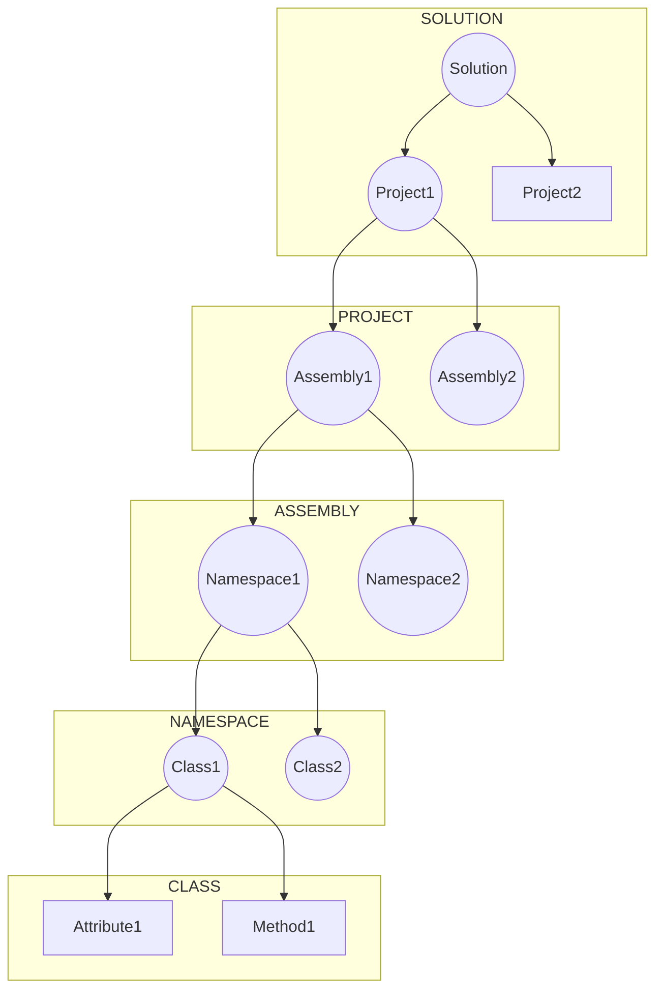

# Focas

## Introduction

Fanuc Focas API is a programming interface provided by Fanuc, a leading manufacturer of industrial robots and CNC (Computer Numerical Control) systems. The Focas API allows developers to interact with and control Fanuc CNC systems using various programming languages. It provides a set of functions and commands that enable applications to retrieve information from CNC controllers, monitor machine status, send commands, and perform data exchanges with the CNC system. The Focas API is widely used in industries such as manufacturing, automation, and robotics to develop custom software solutions for Fanuc CNC machines.

## Quick Overview of Csharp and Project setup in Visual Studio

### Introduction
In C# and .NET, projects are organized using solutions, which consist of one or more projects. This documentation provides an overview of the project structure and key concepts related to C# and .NET development.

### Solutions
- Solutions serve as containers for organizing multiple projects in C# and .NET development.
- A solution represents a higher-level unit that groups related projects together.
- Solutions provide a convenient way to manage dependencies and build configurations for complex software systems.

### Projects
- Projects are the building blocks of a solution and contain the source code and other related files.
- A solution can have multiple projects, each representing a distinct component or module.
- Projects are typically used to organize and manage different aspects of the software solution.

### Assemblies and DLLs
- Once a project is compiled, it produces assemblies or DLLs (Dynamic Link Libraries).
- Assemblies are the output files of the compilation process and contain executable code and other resources.
- Assemblies can be thought of as a group of related namespaces and types.

### Namespaces
- Namespaces are used to organize and group related classes, interfaces, and other types within a project.
- Namespaces provide a way to avoid naming conflicts and provide logical separation between different components of the codebase.
- Namespaces make it easier to manage and navigate large codebases by providing a hierarchical structure.

### Default Namespace in Visual Studio
- By default, Visual Studio will create a namespace that matches the name of the project.
- The default namespace helps maintain a clear and consistent structure for the code within the project.
- Developers can modify the namespace to suit their needs, but it is generally recommended to keep it aligned with the project name.

The following diagram shows the above hierarchy as an UML diagram



### Sample Project Setup

{ align=center }

### Project Directory Structure

    FanucFocas                      # The project root (i guess its a directory)
        properties/                 # This directory may contain project-specific properties or settings files
        references/                 # This directory may contain references to external libraries or dependencies, dll, etc
        App.config/                 # This file is a configuration file for the application. It may contain settings such as connection strings, application-specific configurations, or environment variables.
        fwlib32.cs/                 # This file represents the Focas library for CNC/PMC Data Window Library for FOCAS1/Ethernet. It contains the necessary classes and functions for interacting with 
                                    # Focas enabled CNC machines.
        packages.config/            # This file is used in older versions of .NET Framework projects to manage NuGet package references. It specifies the packages and their versions used in the project.
        Program.cs                  # This file is the entry point of the application. It contains the main code that is executed when the application starts.


### Working with Namespaces and External Libraries in C#

#### Introduction
In C#, namespaces are used to organize and group related classes, structures, and other types. They provide a way to avoid naming conflicts and improve code organization. When working with external libraries, such as the Focas library in your project, namespaces play a crucial role in referencing and accessing the library's classes and structures.

#### Namespaces in C#
- Namespaces are used to logically organize and group related code elements.
- They provide a hierarchical structure and help in avoiding naming conflicts.
- Namespaces improve code readability and maintainability.

#### Using Statements and Namespaces
- To use classes and structures from a namespace, you need to include a **using statement** at the top of your file.
- The using statement allows you to access the classes and structures directly without specifying the fully qualified names.

#### Syntax:
```csharp
using NamespaceName;
```

#### Example:
```csharp
using System;
using MyLibrary;
```

- In the example above, `System` and `MyLibrary` are namespaces that contain the desired classes and structures.

#### Including External Libraries and Using Statements
- When working with external libraries, you need to include the library's files in your project.
- The files containing the classes and structures for the library should be located in a specific directory within your project.
- To access the library's classes and structures, you need to specify the appropriate using statement with the library's namespace.

#### Example:
```csharp
using FocasLibrary;
```
- In this example, `FocasLibrary` is the namespace where the classes and structures from the Focas library are defined.
- The using statement allows you to access those classes and structures directly in your code.

#### The fwlib32.cs File and Global Namespace
- In the provided fwlib32.cs file (as shown in the project directory), the namespace is not explicitly defined (you can open the file and check it out).    
- However, when you include the fwlib32.cs file in your project and build it, the classes and structures in fwlib32.cs are treated as part of the global namespace.
- The global namespace includes all code elements that are not explicitly placed within a namespace.
- This means that you can directly reference the classes and structures from fwlib32.cs without the need for a using statement.


#### Adding the `fwlib.cs` Library to a Visual Studio Project

The following steps outline how to add the `fwlib.cs` library file to your current working project in Visual Studio. The `fwlib.cs` file contains the library code that you want to include in your project.

#### Steps

1. Open your project in Visual Studio.

2. In the Solution Explorer, locate your project folder.

3. Right-click on your project folder to open the context menu.

4. From the context menu, select "Add" and then choose "Existing Item." This action opens the file selection dialog.

5. In the file selection dialog, navigate to the location where the `fwlib.cs` file is located on your computer.

6. Select the `fwlib.cs` file.

7. Click the "Add" button. This action adds the `fwlib.cs` file to your project.

The following figure shows how to add the library file in visual studio

{ align=center }

#### Purpose

Adding the `fwlib.cs` library file to your Visual Studio project is necessary to include the library's code in your project. By doing so, the compiler recognizes the library and its contents, enabling you to utilize its functionality in your code.


## Programs to Demonstrate Focas API

### CODE SAMPLE 1

#### CODE

Here is a sample c# code to get the machine state using fanuc focas api

```csharp
    using System;
    using System.Collections.Generic;
    using System.Linq;
    using System.Text;
    using System.Threading.Tasks;

    namespace FanucFocas
    {
        class Program
        {
            static ushort _handle = 0;
            static short _ret = 0;
            static void Main(string[] args)
            {
                Console.WriteLine("Starting");

                _ret = Focas1.cnc_allclibhndl3("172.18.30.147", 8193, 6, out _handle);

                if (_ret != Focas1.EW_OK)
                {
                    Console.WriteLine("Cannot Connect");
                    Console.Read();
                }
                else {
                    Console.WriteLine($"Our Focas Handle is {_handle}");

                    string mode = GetMode();
                    Console.WriteLine($"\n\nMode is {mode}");

                    Console.Read();
                }

                Focas1.cnc_freelibhndl(_handle);
            }

            public static string GetMode() { 
                if (_handle ==0)
                {
                    Console.WriteLine("Get a handle");
                    return "";
                }

                Focas1.ODBST mode = new Focas1.ODBST();

                _ret = Focas1.cnc_statinfo(_handle, mode);

                if (_ret != 0) {
                    Console.WriteLine("Error: Cannot obtain mode data");
                    return "";
                }
                return $"Mode is {mode.aut}";

            }
        }
    }
```

#### Explanation:

The given C# code demonstrates the usage of the Fanuc Focas API to connect to a Fanuc CNC system and retrieve the operating mode information. Let's go through the code step by step:

1. The code begins with the necessary using statements to import the required namespaces for the program.

2. The FanucFocas namespace is defined to encapsulate the code.

3. Within the FanucFocas namespace, the Program class is defined.

4. The program declares some static variables: _handle of type ushort (unsigned short) to store the handle for the Focas connection, and _ret of type short to store the return values of Focas API functions.

5. The Main method is the entry point of the program. It starts by printing "Starting" to the console.

6. The Focas API function Focas1.cnc_allclibhndl3 is called to establish a connection with the Fanuc CNC system. The method takes the IP address (in this case, "172.18.30.147"), port number (8193), Focas version (6), and an out parameter _handle to receive the handle for the connection. The return value _ret is checked to determine if the connection was successful.

7. If the connection fails, the program prints "Cannot Connect" to the console and waits for user input before exiting.

8. If the connection succeeds, the program prints the obtained _handle value to the console.

9. The GetMode method is called to retrieve the operating mode information from the CNC system.

10. Inside the GetMode method, it first checks if a valid handle _handle exists. If not, it prints "Get a handle" to the console and returns an empty string.

11. It declares an instance of the ODBST struct (a structure provided by the Focas API) named mode.

12. The Focas API function Focas1.cnc_statinfo is called to obtain the mode data using the handle _handle and the mode variable. The return value _ret is checked to ensure successful data retrieval.

13. If the data retrieval is successful, it returns a string indicating the mode by accessing the aut property of the mode struct.

14. Finally, the obtained mode information is printed to the console.

15. The program waits for user input before exiting.

16. After reading the user input, the program calls Focas1.cnc_freelibhndl to free the allocated Focas library handle.

Overall, this code demonstrates the basic usage of the Fanuc Focas API in C# to establish a connection with a Fanuc CNC system and retrieve the operating mode information.

### CODE SAMPLE 2

#### Code

```csharp
    using System;
    using System.Collections.Generic;
    using System.Linq;
    using System.Text;
    using System.Threading.Tasks;

    namespace FanucFocas
    {
        class Program
        {
            static ushort _handle = 0;
            static short _ret = 0;
            static void Main(string[] args)
            {
                Console.WriteLine("Starting");

                _ret = Focas1.cnc_allclibhndl3("172.18.30.147", 8193, 6, out _handle);

                if (_ret != Focas1.EW_OK)
                {
                    Console.WriteLine("Cannot Connect");
                    Console.Read();
                }
                else {
                    Console.WriteLine($"Our Focas Handle is {_handle}");

                    string mode = GetMode();
                    Console.WriteLine($"\n\nMode is {mode}");

                    Console.Read();
                }

                Focas1.cnc_freelibhndl(_handle);
            }

            public static string GetMode() { 
            if (_handle == 0)
            {
                Console.WriteLine("Get a handle");
                return "";
            }

            Focas1.ODBST mode = new Focas1.ODBST();

            _ret = Focas1.cnc_statinfo(_handle, mode);

            if (_ret != 0)
            {
                Console.WriteLine("Error: Cannot obtain mode data");
                return "";
            }

            switch (mode.aut)
            {
                case 0: return "MDI";
                case 1: return "MEM";
                case 3: return "EDIT";
                case 4: return "MPG";
                case 5: return "JOG";
                case 6: return "Teach in JOG";
                case 7: return "Teach in HND";
                case 8: return "INC";
                case 9: return "REF";
                case 10: return "RMT";
                default: return "UNAVAILABLE";
            }

            }
        }
    }
```

#### Explanation

1. The code begins with the necessary using statements to import the required namespaces for the program.

2. The `FanucFocas` namespace is defined to encapsulate the code.

3. Within the `FanucFocas` namespace, the `Program` class is defined.

4. The program declares some static variables: `_handle` of type `ushort` (unsigned short) to store the handle for the Focas connection, and `_ret` of type `short` to store the return values of Focas API functions.

5. The `Main` method is the entry point of the program. It starts by printing "Starting" to the console.

6. The Focas API function `Focas1.cnc_allclibhndl3` is called to establish a connection with the Fanuc CNC system. The method takes the IP address (in this case, "172.18.30.147"), port number (8193), Focas version (6), and an `out` parameter `_handle` to receive the handle for the connection. The return value `_ret` is checked to determine if the connection was successful.

7. If the connection fails, the program prints "Cannot Connect" to the console and waits for user input before exiting.

8. If the connection succeeds, the program prints the obtained `_handle` value to the console.

9. The `GetMode` method is called to retrieve the operating mode information from the CNC system.

10. Inside the `GetMode` method, it first checks if a valid handle `_handle` exists. If not, it prints "Get a handle" to the console and returns an empty string.

11. It declares an instance of the `ODBST` struct (a structure provided by the Focas API) named `mode`.

12. The Focas API function `Focas1.cnc_statinfo` is called to obtain the mode data using the handle `_handle` and the `mode` variable. The return value `_ret` is checked to ensure successful data retrieval.

13. If the data retrieval is successful, a `switch` statement is used to map the `mode.aut` value to the corresponding operating mode string.

14. The operating mode string is returned.

15. Finally, the obtained mode information is printed to the console.

16. The program waits for user input before exiting.

17. After reading the user input, the program calls `Focas1.cnc_freelibhndl` to free the allocated Focas library handle.

#### MODE

The different modes and their corresponding full forms are as follows:

1. `MDI` (Manual Data Input): In this mode, the operator has the ability to input instructions and programs directly into the CNC system manually. While it is not necessary for the operation to be limited to a single line, sometimes we require a simple operation like tool change, which can be accomplished in MDI mode. To achieve this, the machine must be set to MDI mode, and then, using the Human Machine Interface (HMI), the operator can manually enter the G Code that needs to be executed. Once the code is entered, the operator can initiate the cycle start by pressing the corresponding button. An example of such a process can be seen in the video provided. For instance, the code `T01 M06` would be used to change to tool number 1. [Video](https://www.youtube.com/watch?v=FEYfgde8X-0) .

2. `MEM` (Memory): In this mode, the CNC system runs programs stored in its memory. This mode is known as the automatic mode, where the CNC machine loads the entire G Code file into its memory and executes it automatically, without any manual intervention. In this mode, the machine follows the instructions provided in the G Code file from start to finish. The entire code is executed sequentially, allowing for a fully automated operation. The machine takes care of executing each command in the G Code file without requiring any further input or interaction from the operator.

3. `EDIT` (Edit): At times, it becomes necessary to make changes to an existing CNC program, such as adjusting the feed rate or spindle speed. In such cases, the Edit mode provides the operator with the capability to modify or create CNC programs using an editing interface. This mode offers a user-friendly interface specifically designed for editing purposes. The operator can access the program and make the desired modifications, such as changing parameters, adding or removing commands, or adjusting settings related to feed rate and spindle speed. The Edit mode empowers the operator to fine-tune CNC programs to meet specific requirements, ensuring flexibility and customization in the machining process. [video](https://www.youtube.com/watch?v=ew1wzUmSRrw).

4. `MPG` (Manual Pulse Generator): MPG mode is a specific operating mode in CNC systems that allows the operator to manually control the machine's movement using a manual pulse generator device. The manual pulse generator is a handheld device equipped with a rotary knob or wheels that provide precise control over machine motion. In MPG mode, the operator can manually generate pulses or increments of movement using the manual pulse generator. Each pulse corresponds to a specific movement increment, such as a defined distance or angular rotation. By rotating the knob or wheels, the operator can control the speed and direction of the machine tool's movement. By providing precise control over machine movement, MPG mode enhances operator interaction and enables fine adjustments or manual operations that require a high degree of accuracy. It offers a versatile and hands-on approach to machine control, complementing other modes and functionalities provided by CNC systems. [Video](https://youtu.be/GbHLe3g3HGg). MPG mode is particularly useful in various scenarios, including:

    - Fine Positioning: MPG mode allows operators to make small, precise adjustments to position the machine tool accurately. It provides a tactile and intuitive control mechanism, enabling fine-tuning and alignment of workpieces or tooling.

    - Manual Operation: During setup, testing, or maintenance tasks, operators may need to manually control the machine tool for specific operations. MPG mode offers a convenient way to perform manual movements, such as tool alignment, verifying clearances, or inspecting workpiece details.

    - Manual Machining: In certain situations, manual machining or manual intervention is required for complex or delicate operations. MPG mode allows the operator to manually guide the machine tool along the desired path, ensuring precise machining in real-time.

    - Jogging: MPG mode can also be used for jogging the machine tool, allowing the operator to move the machine incrementally in different directions. This feature is useful for step-by-step setup, alignment, or manual machining tasks.

5. `JOG` (Jogging): Jog mode allows the operator to manually move the machine tool in different directions incrementally. Jogging (as an operation, not as a mode) is an essential functionality in CNC (Computer Numerical Control) systems that allows operators to manually move the machine tool in a controlled manner. In jogging mode, the operator can incrementally move the machine tool in different directions, providing flexibility and precision in positioning and setup tasks. Jogging is widely used in various applications, including CNC machining, milling, turning, routing, and more. It offers operators a hands-on approach to position and align the machine tool precisely. By enabling manual control, jogging enhances the operator's ability to perform fine adjustments, verify positions, and ensure optimal machine performance. Here's more information about jogging:

    - Incremental Movements: Jogging enables the operator to move the machine tool incrementally in small steps. The step size can be predefined or adjustable, allowing for fine-tuning of machine positions. The operator typically controls the movement using dedicated buttons, a pendant, or a control panel.

    - Directional Control: Jogging allows movement in multiple directions, such as X, Y, and Z axes. The operator can move the machine tool along each axis independently or simultaneously, depending on the machine's configuration and capabilities.

    - Speed Control: Jogging mode often provides speed control options. Operators can adjust the speed of movement to match the specific requirements of the task. This feature allows for precise positioning and control over the machine tool's motion.

    - Manual Alignment: Jogging is commonly used for aligning tools or workpieces. By manually moving the machine tool, operators can align the cutting tool with the desired position on the workpiece, ensuring accurate machining.

    - Setup and Inspection: Jogging is valuable during setup and inspection tasks. Operators can jog the machine tool to specific positions, allowing them to verify clearances, check dimensions, or align fixtures accurately. It helps in verifying that the workpiece and tooling are correctly positioned before starting automated machining operations.

    - User-Friendly Interface: CNC systems often provide user-friendly interfaces for jogging, including dedicated jog wheels, control pendants, or software-based jog controls. These interfaces enhance the operator's experience by providing intuitive controls and real-time feedback on the machine tool's position.

    - The same jogginf functionality can be achieved


6. `Teach in JOG`: This mode is similar to the JOG mode but specifically designed for teaching the machine by manually moving it through the desired motions.

7. `Teach in HND` (Teach in Handle): This mode enables the operator to control the machine's movement using a manual control handle.

8. `INC` (Incremental): In this mode, the machine tool moves incrementally based on defined increments or distances.

9. `REF` (Reference): The Reference mode allows the machine tool to perform a homing or reference operation.

10. `RMT` (Remote): Remote mode enables the CNC system to receive commands and instructions from an external device or computer.

11. `UNAVAILABLE`: This is the default case when the mode information is unavailable or cannot be retrieved from the CNC system.

Please note that the full forms provided here are general explanations and may vary depending on the specific CNC system or context.


### CODE SAMPLE 3

#### Code

```csharp
    using System;
    using System.Collections.Generic;
    using System.Linq;
    using System.Text;
    using System.Threading.Tasks;

    namespace FanucFocas
    {
        class Program
        {
            static ushort _handle = 0;
            static short _ret = 0;
            static void Main(string[] args)
            {
                Console.WriteLine("Starting");

                _ret = Focas1.cnc_allclibhndl3("172.18.30.147", 8193, 6, out _handle);

                if (_ret != Focas1.EW_OK)
                {
                    Console.WriteLine("Cannot Connect");
                    Console.Read();
                }
                else {
                    Console.WriteLine($"Our Focas Handle is {_handle}");

                    string mode = GetMode();
                    Console.WriteLine($"\n\nMode is {mode}");

                    Console.Read();
                }

                Focas1.cnc_freelibhndl(_handle);
            }

            public static string GetMode() { 
            if (_handle == 0)
            {
                Console.WriteLine("Get a handle");
                return "";
            }

            Focas1.ODBST mode = new Focas1.ODBST();

            _ret = Focas1.cnc_statinfo(_handle, mode);

            if (_ret != 0)
            {
                Console.WriteLine("Error: Cannot obtain mode data");
                return "";
            }

            switch (mode.aut)
            {
                case 0: return "MDI";
                case 1: return "MEM";
                case 3: return "EDIT";
                case 4: return "MPG";
                case 5: return "JOG";
                case 6: return "Teach in JOG";
                case 7: return "Teach in HND";
                case 8: return "INC";
                case 9: return "REF";
                case 10: return "RMT";
                default: return "UNAVAILABLE";
            }

            }

            public static string GetStatus()
            {
                if (_handle == 0)
                {
                    Console.WriteLine("Get a handle");
                    return "";
                }

                Focas1.ODBST status = new Focas1.ODBST();
                _ret = Focas1.cnc_statinfo(_handle, status);

                if (_ret != 0)
                {
                    Console.WriteLine("Error: Cannot obtain status data");
                    return "";
                }

                switch (status.run)
                {
                    case 0: return "*****";
                    case 1: return "STOP";
                    case 2: return "HOLD";
                    case 3: return "STRT";
                    case 4: return "MSTR";
                    default: return "UNAVAILABLE";
                }
            }

        }
    }

```

#### EXPLANATION

The given code is a C# program that uses the Fanuc Focas API to connect to a Fanuc CNC system, retrieve the operating mode information, and obtain the status of the CNC machine. Here's a breakdown of the code:

1. The code begins with the necessary using statements to import the required namespaces for the program.

2. The FanucFocas namespace is defined to encapsulate the code.

3. Within the FanucFocas namespace, the Program class is defined.

4. The program declares some static variables: `_handle` of type `ushort` (unsigned short) to store the handle for the Focas connection, and `_ret` of type `short` to store the return values of Focas API functions.

5. The `Main` method is the entry point of the program. It starts by printing "Starting" to the console.

6. The Focas API function `Focas1.cnc_allclibhndl3` is called to establish a connection with the Fanuc CNC system. The method takes the IP address (in this case, "172.18.30.147"), port number (8193), Focas version (6), and an `out` parameter `_handle` to receive the handle for the connection. The return value `_ret` is checked to determine if the connection was successful.

7. If the connection fails, the program prints "Cannot Connect" to the console and waits for user input before exiting.

8. If the connection succeeds, the program prints the obtained `_handle` value to the console.

9. The `GetMode` method is called to retrieve the operating mode information from the CNC system.

10. Inside the `GetMode` method, it first checks if a valid handle `_handle` exists. If not, it prints "Get a handle" to the console and returns an empty string.

11. It declares an instance of the `ODBST` struct (a structure provided by the Focas API) named `mode`.

12. The Focas API function `Focas1.cnc_statinfo` is called to obtain the mode data using the handle `_handle` and the `mode` variable. The return value `_ret` is checked to ensure successful data retrieval.

13. If the data retrieval is successful, a `switch` statement is used to map the `mode.aut` value to the corresponding operating mode string.

14. The operating mode string is returned and printed to the console.

15. The `GetStatus` method is also defined to retrieve the current status of the CNC machine.

16. The `GetStatus` method is similar to `GetMode` and follows the same pattern of checking the handle, declaring an instance of the `ODBST` struct for status, calling `cnc_statinfo`, and using a `switch` statement to map the `status.run` value to the corresponding status string.

17. Finally, the obtained status information is returned and printed to the console.

18. The program waits for user input before exiting.


The `cnc_statinfo` function is part of the FANUC FOCAS library, which is used for CNC machine control. This function is used to retrieve the status information of the CNC machine.

The `cnc_statinfo` function returns a structure that contains several fields, two of which are `.aut` and `.run`.

- `.aut` field: This field represents the automatic operation mode status. It has three possible values: 0 (MDI mode), 1 (MEM mode), and 2 (EDIT mode).

- `.run` field: This field represents the running status of the CNC machine in automatic mode. It has five possible values:

  - 0: This value is represented as "*****" in the code snippet we've provided. It likely represents a default or uninitialized state.
  - 1: This value is represented as "STOP" in the code snippet, indicating that the CNC machine is in a stopped state.
  - 2: This value is represented as "HOLD" in the code snippet, indicating that the CNC machine is in a hold or paused state. This happens when the `cycle stop` button is pressed in the machine
  - 3: This value is represented as "STRT" in the code snippet, indicating that the CNC machine is in a start or running state.
  - 4: This value is represented as "MSTR" in the code snippet, indicating that the CNC machine is in a master or controlling state.

The "default" case in the switch statement is used to handle any other values that the `.run` field might have. In this case, it returns "UNAVAILABLE", indicating that the running status of the CNC machine is not available or not recognized.

##### SAMPLE SEQUENCE OF MACHINE STATE

The following table shows a sample sequence of machine states and their corresponding execution mode and running status

| S.No | Actual Machine State                                                                                   | Execution Mode (From Focas) | Execution Mode (Mapped Value) | Running Status (From Focas) | Running Status (Mapped Value) |
|------|--------------------------------------------------------------------------------------------------------|-----------------------------|-------------------------------|-----------------------------|-------------------------------|
| 1.   | Machine is in auto Mode, a cycle has been started and it's running                                     | 1                           | MEM                           | 3                           | STRT                          |
| 2.   | Machine is in auto Mode, a cycle has ended from previous state                                         | 1                           | MEM                           | 0                           | ***                           |
| 3.   | Auto Mode, cycle start & Running                                                                       | 1                           | MEM                           | 3                           | STRT                          |
| 4.   | Auto Mode, cycle suspend in middle (pressed the cycle stop button in fanuc controller)                 | 1                           | MEM                           | 2                           | HOLD                          |
| 5.   | Auto Mode, cycle resume after suspend                                                                  | 1                           | MEM                           | 3                           | STRT                          |
| 6.   | Auto Mode, cycle suspend in middle                                                                     | 1                           | MEM                           | 2                           | HOLD                          |
| 7.   | Auto Mode, cycle cancelled (cancelled after suspend, cycle did not get over, by pressing reset button) | 1                           | MEM                           | 0                           | ***                           |
| 8.   | Auto Mode, cycle stop (nothing going), emergency button                                                | 1                           | MEM                           | 0                           | ***                           |
| 9.   | Emergency button released (from previous step)                                                         | 1                           | MEM                           | 0                           | ***                           |
| 10.  | Auto Mode, cycle start, emergency button pressed                                                       | 1                           | MEM                           | 0                           | ***                           |
| 11.  | Emergency button released (from previous step)                                                         | 1                           | MEM                           | 0                           | ***                           |
| 12.  | MDI Mode                                                                                               | 0                           | MDI                           | 1                           | STOP                          |
| 13.  | EDIT Mode                                                                                              | 3                           | EDIT                          | 0                           | ***                           |
| 14.  | MPG Mode                                                                                               | 4                           | MPG (Hand Wheel)              | 0                           | ***                           |
| 15.  | JOG Mode                                                                                               | 5                           | JOG                           | 0                           | ***                           |
| 16.  | REF Mode                                                                                               | 9                           | REF                           | 0                           | ***                           |


### CODE SAMPLE 4

#### Code

```csharp
    using System;
    using System.Threading;

    namespace FanucFocas
    {
        class Program
        {
            static ushort _handle = 0;
            static short _ret = 0;

            static void Main(string[] args)
            {
                Console.WriteLine("Starting");

                _ret = Focas1.cnc_allclibhndl3("172.18.30.147", 8193, 6, out _handle);

                if (_ret != Focas1.EW_OK)
                {
                    Console.WriteLine("Cannot Connect");
                    Console.Read();
                    return;
                }

                Console.WriteLine($"Our Focas Handle is {_handle}");

                // Create a loop to continuously print machine mode and status every 2 seconds
                while (true)
                {
                    Console.WriteLine("=====================");

                    string mode = GetMode();
                    Console.WriteLine($"Mode is {mode}");

                    string status = GetStatus();
                    Console.WriteLine($"Status is {status}");

                    Console.WriteLine("=====================");

                    // Wait for 2 seconds before the next iteration
                    Thread.Sleep(2000);
                }

                Focas1.cnc_freelibhndl(_handle);
            }

            public static string GetMode()
            {
                if (_handle == 0)
                {
                    Console.WriteLine("Get a handle");
                    return "";
                }

                Focas1.ODBST mode = new Focas1.ODBST();
                _ret = Focas1.cnc_statinfo(_handle, mode);

                if (_ret != 0)
                {
                    Console.WriteLine("Error: Cannot obtain mode data");
                    return "";
                }

                switch (mode.aut)
                {
                    case 0: return "MDI";
                    case 1: return "MEM";
                    case 3: return "EDIT";
                    case 4: return "MPG";
                    case 5: return "JOG";
                    case 6: return "Teach in JOG";
                    case 7: return "Teach in HND";
                    case 8: return "INC";
                    case 9: return "REF";
                    case 10: return "RMT";
                    default: return "UNAVAILABLE";
                }
            }

            public static string GetStatus()
            {
                if (_handle == 0)
                {
                    Console.WriteLine("Get a handle");
                    return "";
                }

                Focas1.ODBST status = new Focas1.ODBST();
                _ret = Focas1.cnc_statinfo(_handle, status);

                if (_ret != 0)
                {
                    Console.WriteLine("Error: Cannot obtain status data");
                    return "";
                }

                switch (status.run)
                {
                    case 0: return "*****";
                    case 1: return "STOP";
                    case 2: return "HOLD";
                    case 3: return "STRT";
                    case 4: return "MSTR";
                    default: return "UNAVAILABLE";
                }
            }
        }
    }
```

#### EXPLANATION

The provided code is a C# program that uses the Fanuc Focas API to establish a connection with a Fanuc CNC system, retrieve the machine mode and operational status information, and continuously display them every 2 seconds. It utilizes the `GetMode()` and `GetStatus()` methods to retrieve the corresponding information.

**Line-by-Line Explanation:**

```csharp
using System;
using System.Threading;
```
The necessary namespaces are imported for the program.

```csharp
namespace FanucFocas
{
    class Program
    {
        static ushort _handle = 0;
        static short _ret = 0;
```
The code defines the `FanucFocas` namespace and the `Program` class. It declares two static variables: `_handle` of type `ushort` (unsigned short) to store the Focas connection handle, and `_ret` of type `short` to store the return values of Focas API functions.

```csharp
        static void Main(string[] args)
        {
            Console.WriteLine("Starting");

            _ret = Focas1.cnc_allclibhndl3("172.18.30.147", 8193, 6, out _handle);

            if (_ret != Focas1.EW_OK)
            {
                Console.WriteLine("Cannot Connect");
                Console.Read();
                return;
            }
```
The `Main` method is the entry point of the program. It starts by printing "Starting" to the console. Then, it attempts to establish a connection with the Fanuc CNC system using the `Focas1.cnc_allclibhndl3` API function, providing the IP address, port number, Focas version, and the `_handle` variable to receive the handle. If the connection fails, an error message is displayed and the program terminates.

```csharp
            Console.WriteLine($"Our Focas Handle is {_handle}");
```
If the connection succeeds, the obtained `_handle` value is printed to the console.

```csharp
            while (true)
            {
                Console.WriteLine("=====================");

                string mode = GetMode();
                Console.WriteLine($"Mode is {mode}");

                string status = GetStatus();
                Console.WriteLine($"Status is {status}");

                Console.WriteLine("=====================");

                Thread.Sleep(2000);
            }
```
A `while` loop is created to continuously retrieve and display the machine mode and operational status every 2 seconds. Inside the loop, the mode and status information are obtained using the `GetMode()` and `GetStatus()` methods respectively. The information is then printed to the console with appropriate labels. The loop is paused for 2 seconds using `Thread.Sleep()` before the next iteration.

```csharp
            Focas1.cnc_freelibhndl(_handle);
        }
```
Finally, after exiting the loop, the `Focas1.cnc_freelibhndl` API function is called to free the allocated Focas library handle.

```csharp
        public static string GetMode()
        {
            // Mode retrieval logic
        }
```
The `GetMode()` method is defined to retrieve the machine mode information from the CNC system. It returns a string representation of the mode.

```csharp
        public static string GetStatus()
        {
            // Status retrieval logic
        }
    }
}
```
Similarly, the `GetStatus()` method is defined to retrieve the operational status of the CNC machine. It returns a string representation of the status.

The remaining part of the code contains the closing braces to close the `Program` class and `FanucFocas` namespace.

Overall, the program establishes a connection with

 the Fanuc CNC system, retrieves and continuously displays the machine mode and operational status every 2 seconds until terminated.

 
### CODE SAMPLE 5

#### Code

```csharp
using System;
using System.Threading;

namespace FanucFocas
{
    class Program
    {
        static ushort _handle = 0;
        static short _ret = 0;

        static void Main(string[] args)
        {
            Console.WriteLine("Starting");

            _ret = Focas1.cnc_allclibhndl3("172.18.30.147", 8193, 6, out _handle);

            if (_ret != Focas1.EW_OK)
            {
                Console.WriteLine("Cannot Connect");
                Console.Read();
                return;
            }

            Console.WriteLine($"Our Focas Handle is {_handle}");

            // Register the event handler for Ctrl+C or closing the terminal window
            Console.CancelKeyPress += Console_CancelKeyPress;

            try
            {
                // Create a loop to continuously print machine mode, status, and active program every 2 seconds
                while (true)
                {
                    Console.WriteLine("=====================");

                    string mode = GetMode();
                    Console.WriteLine($"Mode is {mode}");

                    string status = GetStatus();
                    Console.WriteLine($"Status is {status}");

                    GetExecutionProgram();

                    Console.WriteLine("=====================");

                    // Wait for 2 seconds before the next iteration
                    Thread.Sleep(2000);
                }
            }
            finally
            {
                // Free the Focas handle when the loop exits
                Focas1.cnc_freelibhndl(_handle);
            }
        }

        private static void Console_CancelKeyPress(object sender, ConsoleCancelEventArgs e)
        {
            // Cancel the event to prevent termination
            e.Cancel = true;

            // Exit the program gracefully
            Environment.Exit(0);
        }

        public static string GetMode()
        {
            if (_handle == 0)
            {
                Console.WriteLine("Get a handle");
                return "";
            }

            Focas1.ODBST mode = new Focas1.ODBST();
            _ret = Focas1.cnc_statinfo(_handle, mode);

            if (_ret != 0)
            {
                Console.WriteLine("Error: Cannot obtain mode data");
                return "";
            }

            switch (mode.aut)
            {
                case 0: return "MDI";
                case 1: return "MEM";
                case 3: return "EDIT";
                case 4: return "MPG";
                case 5: return "JOG";
                case 6: return "Teach in JOG";
                case 7: return "Teach in HND";
                case 8: return "INC";
                case 9: return "REF";
                case 10: return "RMT";
                default: return "UNAVAILABLE";
            }
        }

        public static string GetStatus()
        {
            if (_handle == 0)
            {
                Console.WriteLine("Get a handle");
                return "";
            }

            Focas1.ODBST status = new Focas1.ODBST();
            _ret = Focas1.cnc_statinfo(_handle, status);

            if (_ret != 0)
            {
                Console.WriteLine("Error: Cannot obtain status data");
                return "";
            }

            switch (status.run)
            {
                case 0: return "*****";
                case 1: return "STOP";
                case 2: return "HOLD";
                case 3: return "STRT";
                case 4: return "MSTR";
                default: return "UNAVAILABLE";
            }
        }

        public static void GetExecutionProgram()
        {
            if (_handle == 0)
            {
                Console.WriteLine("Get a handle");
                return;
            }

            Focas1.ODBEXEPRG prg_info = new Focas1.ODBEXEPRG();

            _ret = Focas1.cnc_exeprgname(_handle, prg_info);

            if (_ret != 0)
            {
                Console.WriteLine("Error: Cannot obtain program data");
                return;
            }
            string programName = new string(prg_info.name).TrimEnd('\0');

            Console.WriteLine($"Executing Program Name: {programName}");
        }
    }
}
```

#### Explanation

The provided code is a C# program that interacts with a FANUC CNC machine using the Focas library. It connects to the CNC machine, retrieves information about the machine's mode, status, and active program, and continuously prints this information every 2 seconds.

Let's go through the code step by step:

```csharp
using System;
using System.Threading;
```
The code includes necessary namespaces for the program.

```csharp
namespace FanucFocas
{
    class Program
    {
        static ushort _handle = 0;
        static short _ret = 0;
```
The code defines a namespace (`FanucFocas`) and a class (`Program`). It also declares two static variables `_handle` (of type `ushort`) and `_ret` (of type `short`) to store the Focas handle and return value respectively.

```csharp
        static void Main(string[] args)
        {
            Console.WriteLine("Starting");

            _ret = Focas1.cnc_allclibhndl3("172.18.30.147", 8193, 6, out _handle);

            if (_ret != Focas1.EW_OK)
            {
                Console.WriteLine("Cannot Connect");
                Console.Read();
                return;
            }
```
The `Main` method is the entry point of the program. It first prints "Starting" to the console. Then it calls the `cnc_allclibhndl3` function from the Focas library to establish a connection with the CNC machine using the specified IP address ("172.18.30.147"), port number (8193), and timeout (6 seconds). The Focas handle is stored in the `_handle` variable, and the return value is stored in the `_ret` variable.

If the connection is unsuccessful (return value is not equal to `Focas1.EW_OK`), it prints "Cannot Connect" and waits for user input before exiting the program.

```csharp
            Console.WriteLine($"Our Focas Handle is {_handle}");

            // Register the event handler for Ctrl+C or closing the terminal window
            Console.CancelKeyPress += Console_CancelKeyPress;

            try
            {
                // Create a loop to continuously print machine mode, status, and active program every 2 seconds
                while (true)
                {
                    Console.WriteLine("=====================");

                    string mode = GetMode();
                    Console.WriteLine($"Mode is {mode}");

                    string status = GetStatus();
                    Console.WriteLine($"Status is {status}");

                    GetExecutionProgram();

                    Console.WriteLine("=====================");

                    // Wait for 2 seconds before the next iteration
                    Thread.Sleep(2000);
                }
            }
            finally
            {
                // Free the Focas handle when the loop exits
                Focas1.cnc_freelibhndl(_handle);
            }
        }
```
The program then prints the obtained Focas handle to the console. It registers the `Console_CancelKeyPress` method as an event handler for the Ctrl+C key press or closing the terminal window. This ensures that the program exits gracefully when these events occur.

Inside the `try` block, the program enters a loop that continuously retrieves and prints information about the machine's mode, status, and active program every 2 seconds.

The `GetMode()` method is called to retrieve the current machine mode, which is then printed to the console.

The `GetStatus()` method is called to retrieve the current machine status, which is also printed to the console.

The `GetExecutionProgram()` method is called to retrieve the name of the currently executing program on the machine, which is printed to the console.

After printing the information, the program waits for

 2 seconds using `Thread.Sleep(2000)` before the next iteration of the loop.

Finally, in the `finally` block, the Focas handle is released using the `cnc_freelibhndl` function to free up resources when the program exits.

```csharp
        private static void Console_CancelKeyPress(object sender, ConsoleCancelEventArgs e)
        {
            // Cancel the event to prevent termination
            e.Cancel = true;

            // Exit the program gracefully
            Environment.Exit(0);
        }
```
The `Console_CancelKeyPress` method is an event handler that is triggered when the Ctrl+C key is pressed or the terminal window is closed. It cancels the event (`e.Cancel = true`) to prevent immediate termination of the program. Then it gracefully exits the program using `Environment.Exit(0)`.

```csharp
        public static string GetMode()
        {
            if (_handle == 0)
            {
                Console.WriteLine("Get a handle");
                return "";
            }

            Focas1.ODBST mode = new Focas1.ODBST();
            _ret = Focas1.cnc_statinfo(_handle, mode);

            if (_ret != 0)
            {
                Console.WriteLine("Error: Cannot obtain mode data");
                return "";
            }

            switch (mode.aut)
            {
                case 0: return "MDI";
                case 1: return "MEM";
                case 3: return "EDIT";
                case 4: return "MPG";
                case 5: return "JOG";
                case 6: return "Teach in JOG";
                case 7: return "Teach in HND";
                case 8: return "INC";
                case 9: return "REF";
                case 10: return "RMT";
                default: return "UNAVAILABLE";
            }
        }
```
The `GetMode()` method retrieves the current machine mode. It first checks if a valid Focas handle exists. If not, it prints "Get a handle" and returns an empty string.

It creates an instance of the `Focas1.ODBST` structure to store the mode information. Then it calls the `cnc_statinfo` function to retrieve the mode data using the Focas handle. The return value is stored in the `_ret` variable.

If an error occurs during the retrieval (return value is not equal to 0), it prints "Error: Cannot obtain mode data" and returns an empty string.

Otherwise, it uses a `switch` statement on the `mode.aut` value to determine the mode and returns the corresponding string representation.

```csharp
        public static string GetStatus()
        {
            if (_handle == 0)
            {
                Console.WriteLine("Get a handle");
                return "";
            }

            Focas1.ODBST status = new Focas1.ODBST();
            _ret = Focas1.cnc_statinfo(_handle, status);

            if (_ret != 0)
            {
                Console.WriteLine("Error: Cannot obtain status data");
                return "";
            }

            switch (status.run)
            {
                case 0: return "*****";
                case 1: return "STOP";
                case 2: return "HOLD";
                case 3: return "STRT";
                case 4: return "MSTR";
                default: return "UNAVAILABLE";
            }
        }
```
The `GetStatus()` method retrieves the current machine status. It follows a similar structure as the `GetMode()` method.

It first checks if a valid Focas handle exists. If not, it prints "Get a handle" and returns an empty string

.

It creates an instance of the `Focas1.ODBST` structure to store the status information. Then it calls the `cnc_statinfo` function to retrieve the status data using the Focas handle. The return value is stored in the `_ret` variable.

If an error occurs during the retrieval (return value is not equal to 0), it prints "Error: Cannot obtain status data" and returns an empty string.

Otherwise, it uses a `switch` statement on the `status.run` value to determine the status and returns the corresponding string representation.

```csharp
        public static void GetExecutionProgram()
        {
            if (_handle == 0)
            {
                Console.WriteLine("Get a handle");
                return;
            }

            Focas1.ODBEXEPRG prg_info = new Focas1.ODBEXEPRG();

            _ret = Focas1.cnc_exeprgname(_handle, prg_info);

            if (_ret != 0)
            {
                Console.WriteLine("Error: Cannot obtain program data");
                return;
            }
            string programName = new string(prg_info.name).TrimEnd('\0');

            Console.WriteLine($"Executing Program Name: {programName}");
        }
    }
}
```

The `GetExecutionProgram()` method retrieves the name of the currently executing program on the machine.

It first checks if a valid Focas handle exists. If not, it prints "Get a handle" and returns.

It creates an instance of the `Focas1.ODBEXEPRG` structure to store the program information. Then it calls the `cnc_exeprgname` function to retrieve the program data using the Focas handle. The return value is stored in the `_ret` variable.

If an error occurs during the retrieval (return value is not equal to 0), it prints "Error: Cannot obtain program data" and returns.

Otherwise, it converts the program name from a null-terminated character array to a string by creating a new string and trimming the null character (`'\0'`) at the end. The program name is then printed to the console.

That's a walkthrough of the provided code! It connects to a FANUC CNC machine, retrieves and prints information about the machine's mode, status, and active program in a continuous loop. It handles graceful program termination and cleanup when necessary.