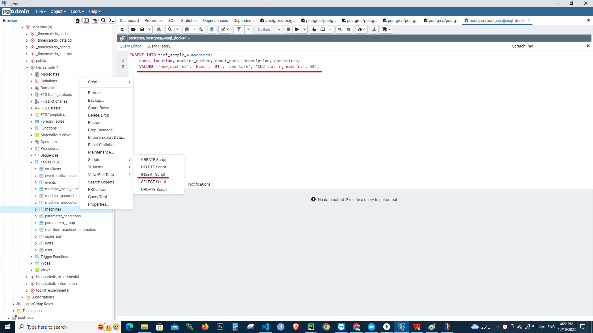
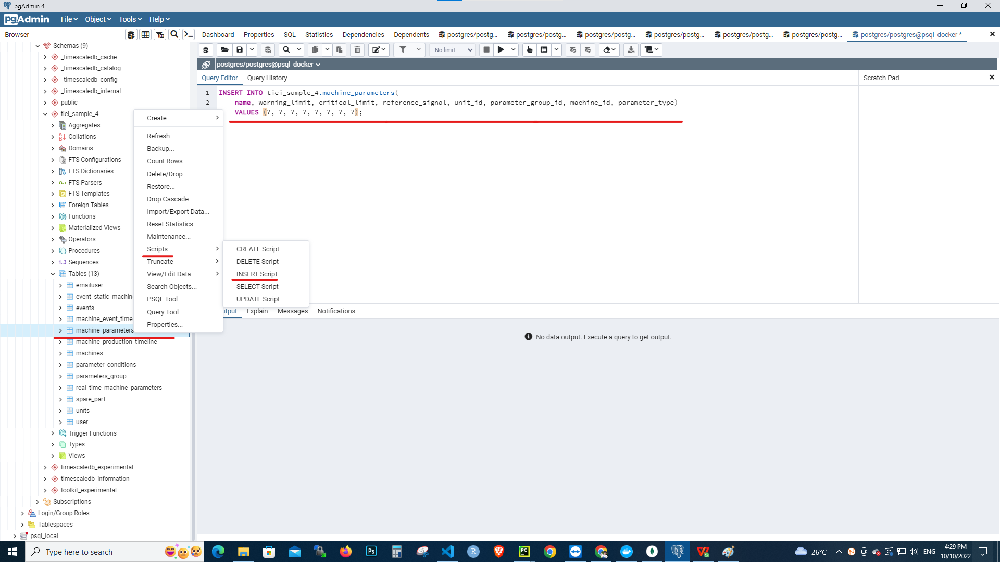
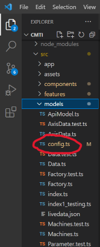
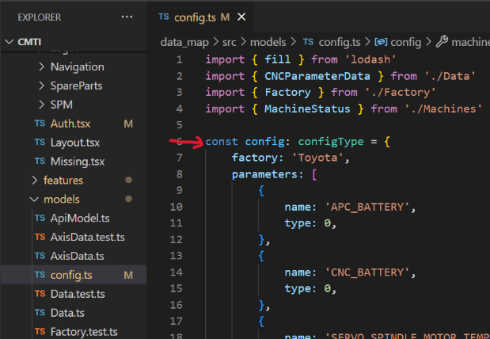
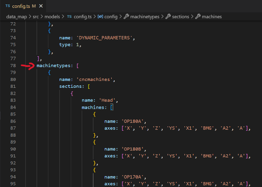
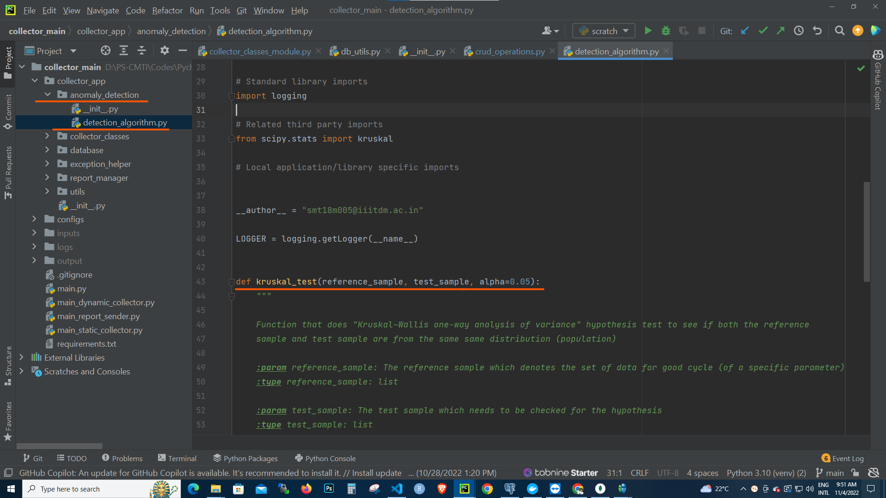
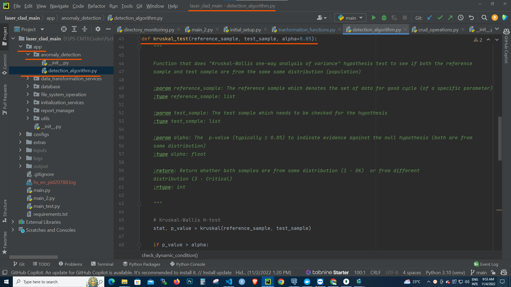
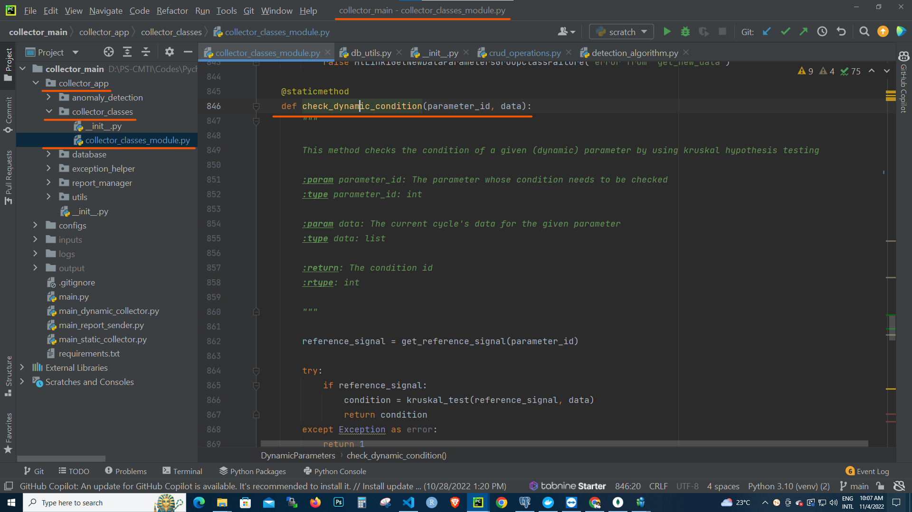
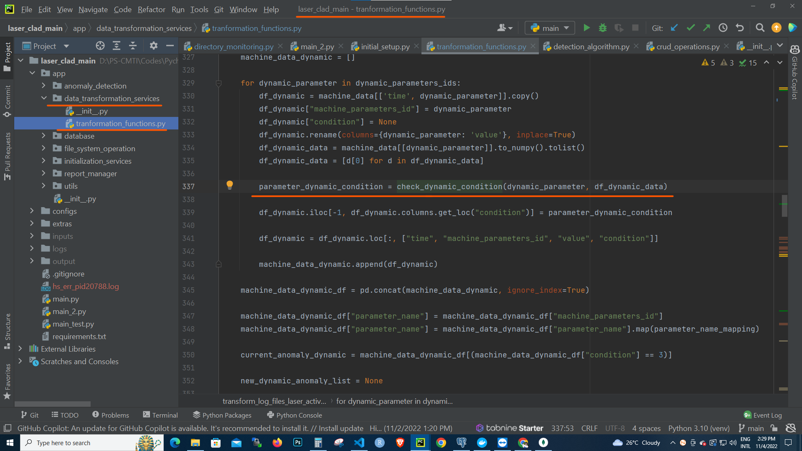
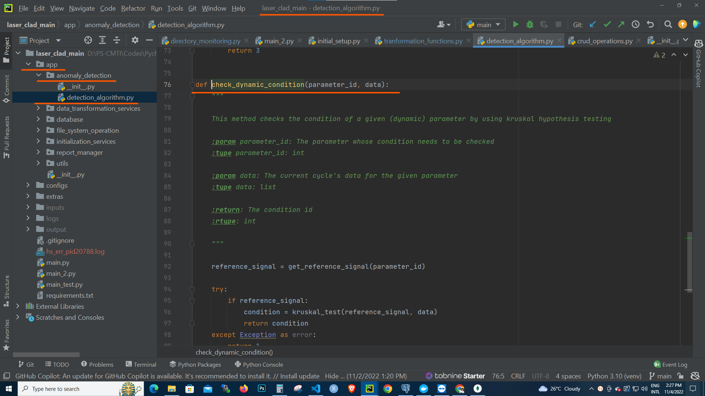

# Troubleshooting & FAQ

## Introduction

This section shows some of the common problems that you might face, and how to quickly solve them.

## How to add new machine??

### CNC machine with MtLinki

There are some modifications that need to be done to the collector

- ***Collector***:

    If the machine is already connected to the MtLinki, then there are few steps that needs to followed:

    - **STEP 1:** Add the machine to the *machines* table

    { align=center }

    !!! note

        You can omit the id and enabled column while inserting (creating) a new machine, since these will be set to default values automcatically.

    - **STEP 2:** Add its parameters to the *machine_parameters* table

    { align=center }

    !!! note

        You can omit the id column, omit the critical and warning limts if the parameter is of type dynamic, and omit reference signal if its of type static. Make sure to insert the correct machine_id (corresponds to the id of the machine created at previous step and can be found by querying from the *machines* table), parameter_group_id (refer to the *parameters_group* table to find the corresponding id for the paramter group), unit_id (corresponds to the row id of the *units* table, if the requried unit is not available create (insert) a new unit or use no units as temporary unit) and parameter type. And also make sure that you insert the parameters into the table in right order(corresponding to its axis names), it is the same order that you want it to be displayed in the front end or as given in the machining axis document. The parameter name should be same as the signalname in MtLinki Mongodb.**The parameter name should be unique in the database**, if the name is not unique, add the machine name along with the parameter, such as "carrier gas_laser_cladding_jop199".
    
    - **STEP 3:** Restart the *static and dynamic collector* services (as shown in the following sections).

- ***Front End***:

    All the information related to machines and their parameters can be configured by modifying the *config.ts* file.:

    - **STEP 1:** Open the config.ts file

    { align=center }

    The config.ts file is located in the following location (the front end code needs to be downloaded from the github and opened in any editor) from the root directory of the project.

        /src/models/configs.ts


    - **STEP 2:** Modify the config object

    { align=center }

    The config object in this file represents the configuration parameters for the front end elements. This object has a property *machinetypes*. This needs to be modified. This organizes the machines into sections, you can add new machine and their corresponding axis/parameters names under the corresponding section. For example to add new machine "T_H_OP6666", add the following code to the machines property under the section head.

    ```json

    {
        "name": "T_H_OP6666",
        "axes": ["X", "Y", "Z", "X1"]
    }

    ```

    The key point to note is, **the axes names should be ordered exactly how the appear (inserted) in the database, under the table machine_parameters**, but the name could differ, such as ServoLoad_1_path1_T_H_OP6666 could be mapped to X1 (but the ordering should be same, i.e ServoLoad_1_path1_T_H_OP6666 should be the fourth parameter for this machine in this parameter group (servo and spinle load) when orderded(in ascending) by the id in the machine_paramters table)

    { align=center }

    - **STEP 3:** Build the front end code and deploy.

    Run the following command (from your vs code terminal)

    ```npm
    npm run build
    ```
    This will generate the build files.

    The contents of the build files need to be copied to the apache server location

        /var/www/tnga_iot
    
    !!! warning
        Copy the contents of the apache server directory to any new folder before moving the new build files, so that if the new build doesn't work as intened, you could replace it back with original files.

    Press *ctrl + F5* , in the front to force refresh the web page to reflect the new changes. 

- ***Back End***:

    The back need to not be modified, it is self containted and reacts automatically to any changes happening to the collector and front end.

### SPM machines

These machine need a more custom solution as detailed below.

- ***Collector***:

    The collector has to be developed based on how the data is available for the machine, it could be log files, proprietary api (such as haas mdc, fanuc focas). The user has to develop scripts to continuous monitor the machine for new data and add those data to the timescale database. There is no general script for it but there are certain guidelines that needs to be followed while developing the custom script for the spm machines.

    - **STEP 1:** Add the machine to the *machines* table

    { align=center }

    !!! note

        You can omit the id and enabled column while inserting (creating) a new machine, since these will be set to default values automcatically.

    - **STEP 2:** Add its parameters to the *machine_parameters* table

    { align=center }

    !!! note

        You can omit the id column, omit the critical and warning limts if the parameter is of type dynamic, and omit reference signal if its of type static. Make sure to insert the correct machine_id (corresponds to the id of the machine created at previous step and can be found by querying from the *machines* table), **you can omit the parameter_group_id since they are not applicable for spm machines**, unit_id (corresponds to the row id of the *units* table, if the requried unit is not available create (insert) a new unit or use no units as temporary unit) and parameter type (** "spm_static" for static paramter,and "spm_dynamic" for dynamic paramters**). And also make sure that you insert the parameters into the table in right order(corresponding to its axis names), it is the same order that you want it to be displayed in the front end or as given in the machining axis document. **The parameter name should be unique in the database**, if the name is not unique, add the machine name along with the parameter, such as "carrier gas_laser_cladding_jop199".
    
    - **STEP 3:** Data format:

        The raw data from the machine, (either in log files or other format) need to be transformed to have four columns "time", "machine_parameters_id", "value", "condition_id", where the machine_parameters_id is the id of the row corresponding to the machine parameter in the machine parameters table, and condition id can take values "1", "2", or "3", corresponding to the id of rows from the parameter_conditions table. Once these format is transformed, they need to be inserted into *real_time_machine_parameters* table. For the *real_time_machine_parameters_active* table only the recent most data need to be **updated**. The key point is, the new data needs to be inserted/added to the *real_time_machine_parameters* table, but the recent most data need to replace the old data by updating the corresponding row (for that specific parameter) in the *real_time_machine_parameters_active* table.

- ***Front End***:

    All the information related to machines and their parameters can be configured by modifying the *config.ts* file.:

    - **STEP 1:** Open the config.ts file

    { align=center }

    The config.ts file is located in the following location (the front end code needs to be downloaded from the github and opened in any editor) from the root directory of the project.

        /src/models/configs.ts


    - **STEP 2:** Modify the config object

    { align=center }

    The config object in this file represents the configuration parameters for the front end elements. This object has a property *machinetypes*. This needs to be modified. This organizes the machines into sections, you can add new machine and their corresponding axis/parameters names under the corresponding section. For example to add new machine "T_H_OP6666", add the following code to the machines property under the section head.

    ```json

    {
        "name": "T_H_OP6666",
        "axes": ["X", "Y", "Z", "X1"]
    }

    ```

    The key point to note is, **the axes names should be ordered exactly how the appear (inserted) in the database, under the table machine_parameters**, but the name could differ, such as ServoLoad_1_path1_T_H_OP6666 could be mapped to X1 (but the ordering should be same, i.e ServoLoad_1_path1_T_H_OP6666 should be the fourth parameter for this machine in this parameter group (servo and spinle load) when orderded(in ascending) by the id in the machine_paramters table)

    { align=center }

    - **STEP 3:** Build the front end code and deploy.

        Run the following command (from your vs code terminal)

        ```npm
        npm run build
        ```
        This will generate the build files.

        The contents of the build files need to be copied to the apache server location

            /var/www/tnga_iot
        
        !!! warning
            Copy the contents of the apache server directory to any new folder before moving the new build files, so that if the new build doesn't work as intened, you could replace it back with original files.

        Press *ctrl + F5* , in the front to force refresh the web page to reflect the new changes. 
    
- ***Back End***:

    The back need to not be modified, it is self containted and reacts automatically to any changes happening to the collector and front end.


## How to change anomaly detection algorithm for dynamic parameters??

All the anomaly detection task are carried out in the module *anomaly_detection* within the main application (be it cnc data collector, laser cladding collector etc).

The structure of that module is shown below:

{ align=center }

{ align=center }

As seen in the above pictures the function that carries out the detection method (kruskal method here) is implemented in the *detection_algorithm.py* script

The contents of this function can be changed to use a different algorithm.

!!! warning

    Do not change the function name (even if the new algorithm has different name) to ease out the transition to new algorithm.

Any new algorithm should follow the following guidelines:

- It Should accept a refence signal

- It should accept sample signal

- It should accept a threshold value (if not can use a default value of zero)

- Should return **3** if the condition of the sample signal is classified as abnormal/critical

- Should return **2** if the condition of the sample signal is classified as warning

- Should return **1** if the condition of the sample signal is classified as normal

This function is used in the following places as shown below

{ align=center }

{ align=center }

{ align=center }


If in case you want to change the algorithm to other advanced algorithm, with different set of arguments, then you could change the function (and its name) and call that function with appropriate signature in the above mentioned places.


## How to remove existing axis/parameter of a machine??

### CNC machine with MtLinki

There are some modifications that need to be done to the timescale db

- ***Timescale DB***:

    - **STEP 1:** Delete all realtime data and realtime active data corresponding to the axis/parameter:

        The corresponding parameter's id needs to found and their records in the real_time_machine_parameters and real_time_machine_parameters_active table needs to be deleted

        Use the following code to find the id of the parameter:

        ```SQL

        SELECT id, name, warning_limit, critical_limit, reference_signal, unit_id, parameter_group_id, machine_id, parameter_type
            FROM tiei_sample_4.machine_parameters
        WHERE name = 'CncFan1Speed_path1_T_B_OP180'

        ```

        where you should replace *CncFan1Speed_path1_T_B_OP180* with the **actual name of the parameter as stored in MtLink in Mongodb**.

        Use the following code to delete all the records from the realtime_machine_parameters tables:

        ```SQL

        DELETE FROM tiei_sample_4.real_time_machine_parameters
        WHERE machine_parameters_id = 163;

        ```

        where you should replace 163 with the **id of the parameter returned from the previous search**.

        Use the following code to delete all the records from the realtime_machine_parameters_active tables:

        ```SQL

        DELETE FROM tiei_sample_4.real_time_machine_parameters_active
        WHERE machine_parameters_id = 163;

        ```

        where you should replace 163 with the **id of the parameter returned from the previous search**.

        !!! warning

            Be cautious when using the above commands as they will delete all records from the table, if important parameter data are deleted, then they cannot be recovered.

        - **STEP 2:** Delete the Parameter from MtLinki MongoDB

        This is important step, the parameter needs to be deleted from the mongodb also, else the collector will throw error.
        
        - **STEP 3:** Restart the *static and dynamic collector* services (as shown in the following sections).

- ***Front End***:

    All the information related to machines and their parameters can be configured by modifying the *config.ts* file.:

    - **STEP 1:** Open the config.ts file

        { align=center }

        The config.ts file is located in the following location (the front end code needs to be downloaded from the github and opened in any editor) from the root directory of the project.

            /src/models/configs.ts


    - **STEP 2:** Modify the config object

        { align=center }

        The config object in this file represents the configuration parameters for the front end elements. This object has a property *machinetypes*. This needs to be modified. This organizes the machines into sections, you can remove axis/parameters names under the corresponding section. For example to remove "X" axis from the machine "T_H_OP6666", the following modification has to be done to the machines property under the section head.

        1. Before

            ```json

                {
                    "name": "T_H_OP6666",
                    "axes": ["X", "Y", "Z", "X1"]
                }

            ```

        2. After

            ```json

                {
                    "name": "T_H_OP6666",
                    "axes": ["Y", "Z", "X1"]
                }

            ```

    - **STEP 3:** Build the front end code and deploy.
    
        Run the following command (from your vs code terminal)

        ```npm
        npm run build
        ```
        This will generate the build files.

        The contents of the build files need to be copied to the apache server location

            /var/www/tnga_iot
        
        !!! warning
            Copy the contents of the apache server directory to any new folder before moving the new build files, so that if the new build doesn't work as intened, you could replace it back with original files.

        Press *ctrl + F5* , in the front to force refresh the web page to reflect the new changes. 
- ***Back End***:

    The back need to not be modified, it is self containted and reacts automatically to any changes happening to the collector and front end.


## How to restart services (and check it status)??

### Check the Status

The following code can be used to check the status of any service

``` cmd

systemctl status static_collector

```

You could replace the *static_collector* with the service you want to check.

The following images shows the result of using that command

{ align=center }

{ align=center }

You shall press *ctrl + c* to get back your terminal from the service status (if required).
### Restart the Service

The following code can be used to restart any service

``` cmd

systemctl restart static_collector

```

You could replace the *static_collector* with the service you want to restart.


!!! tip

    Once in a while you can check the status of all services, or if in case there is any issue you can check all the services and try restarting any service that is inactive/dead. If nothing else works, you can always contact CMTI, We're happy to help! 😃 🤝🏻